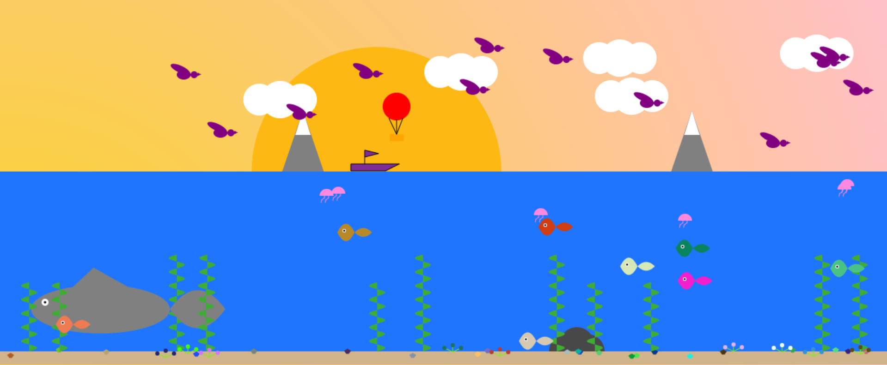
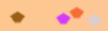

= Compte rendu : _Projet Virtual Landscape_
:toc-title: Tables des matières
:toc: top

Projet réalisé par : +
*TANDABANY* Adrien +

Du 05/04/2023 au 10/05/2023

== *Contexte :* +
----
Dans le cadre du projet Virtual Landscape, l'objectif était d'apprendre à travailler avec un nouveau langage de programmation "JavaScript" dans une approche objet et événementielle, puis utiliser une API en autodidacte. Et enfin, développer notre créativité.
----

===  *Introduction :* +
----
Après avoir cerné les objectifs de ce projet, verrons comment créer un objet et l'exploiter, puis les difficultés rencontrées et enfin, nous terminerons par une conclusion personnelle.
----

<<<

== *I. Création du projet*

Le projet s'est inspiré de la nature et du milieu aquatique avec un dessin et des couleurs enfantins.

L'explication qui va suivre portera sur l'objet coquillage. La structure du code est identique pour tous les autres objets hormis les valeurs et le tracé du dessin.

Tout d'abord, nous créons un nouveau fichier que l'on nommera Coquillage.js.

Ce code importe la classe AbstractForm à partir du fichier AbstractForm.js. Elle permet à la classe Coquillage et d'hériter de la classe AbstractForm et ainsi fonctionner.
[source,js]
----
{ AbstractForm } from './AbstractForm.js';
----

<<<

La classe Coquillage a un constructeur qui prend neuf paramètres avec des valeurs. Les paramètres sont les suivants : les coordonnées x et y, la largeur et la hauteur, les couleurs de remplissage et de contour, l'épaisseur, la pesanteur et l'ordre de construction.
[source,js]
----
export class Coquillage extends AbstractForm {
  constructor( x = 0,
    y = 0,
    width = 0,
    height = 0,
    fillColor = '',
    strokeColor = '',
    strokeWidth = 2,
    pesenteur = true,
    ordreConstruction = 100
  )
----

Ce code permet d'appeler le constructeur de la classeAbstractForm en lui transférant les paramètres ci-dessous. Cela permet à la classe Coquillage d'obtenir toutes les fonctionnalités la classe AbstractForm, tout en gardant ses propres paramètres.
[source,js]
----
{
  super(x, y, width, length, fillColor, strokeColor, strokeWidth, pesenteur, ordreConstruction)
}
----

<<<

Nous créons la méthode appelée coquillage. Nous stockons les coordonnées dx et dy dans les variables ox et oy. "let color" permet de changer aléatoirement les couleurs des coquillages. Puis nous dessinons le coquillage avec les variables ox et oy.
[source,js]
----
coquillage(ctx, dx, dy) {
  let ox = dx
  let oy = dy
  let color = `rgb(${Math.random() * 255}, ${Math.random() * 255}, ${Math.random() * 255})`

  ctx.beginPath();
  ctx.fillStyle = color;
  ctx.moveTo(ox + 5.25, oy + 4);
  ctx.lineTo(ox + 0.25, oy + 7.125);
  ctx.lineTo(ox + 3.375, oy + 11.5);
  ctx.lineTo(ox + 7.125, oy + 11.5);
  ctx.lineTo(ox + 10.25, oy + 7.125);
  ctx.fill(); }
----
NOTE: Il n'est pas nécessaire d'appliquer "let color" pour avoir des couleurs aléatoires. Nous pouvons indiquer une couleur qui sera fixe dans ctx.fillStyle. Par exemple, ctx.fillStyle = 'purple';

La méthode draw dessine l'objet Coquillage en appelant la méthode coquillage. Elle sauvegarde les "ctx" puis elle appelle la méthode coquillage pour dessiner l'objet. Enfin, elle restaure les ctx antérieurs.
[source,js]
----
draw(ctx){
 ctx.save()
 this.coquillage(ctx, this.x, this.y)
 ctx.restore()
}
----

La ligne de code indique que la fonction retourne un tableau d'objets.
[source,js]
----
@return {[Coquillage,...]}
----

<<<

La méthode construit un tableau d'instances de la classe Coquillage. Nous utilisons une boucle for pour créer un nombre aléatoire d'instances de Coquillage. Nous reprenons les mêmes paramètres cités précédemment.

[source,js]
----
static buildForms() {
  let forms = []
  for (let i = 0; i <= ~~(Math.random() * 300); i++) {
    forms.push(new Coquillage(~~(Math.random() * 1260), ~~(Math.random() * 10) + 500, 100, 100, 'blue', 'black', 1, true, 2))
  }
----
NOTE: Si nous voulons un nombre précis de coquillage, nous pouvons nous dispenser d'une boucle. De plus, nous pouvons aussi nous dispenser de "Math.ramdom()" si nous souhaitons une coordonnée (x et y) fixe.

Enfin, la méthode retourne le tableau de toutes les Coquillage créées.
[source,js]
----
return forms
----

Et nous exportons la classe avec la ligne de code ci-dessous afin de visualiser nos coquillages.
[source,js]
----
export { Coquillage } from './Coquillage.js';
----

== *II. Difficultés rencontrées*
La première difficulté comme tout nouveau projet a été de comprendre les objectifs et d'assimiler de nouvelles connaissances.

Puis la seconde difficulté a été de trouver l'inspiration. En effet, il a été difficile pour moi de réaliser un projet original et qui puisse avant tout être atteignable et en même temps livrable dans les délais imposés.

Enfin, quelques difficultés sur l'usage de certaines méthodes.

== *II. Conclusion*
Le projet a été très instructif, et cela m'a permis de programmer d'une manière différente. Cependant, je n'ai pas réussi à assimiler et à utiliser certains fondements comme la pesanteur qui aurait été plus que nécessaire dans mon projet. Enfin, je ressentais une certaine limite car, mes objets n'étaient qu'une succession de traits et de cercles et je devais parfois faire appel a des outils extérieurs (Forum, Youtube, ChatGPT) pour réaliser des objets originaux.
